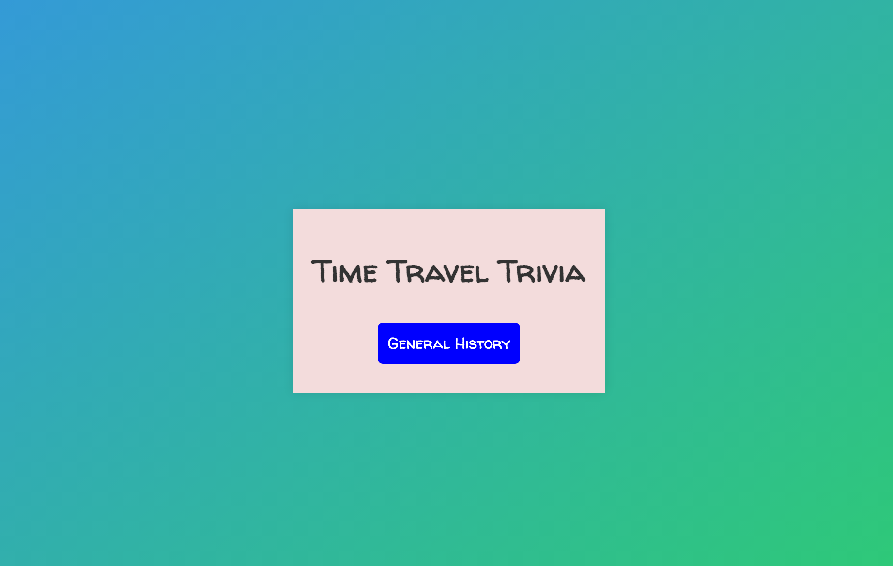
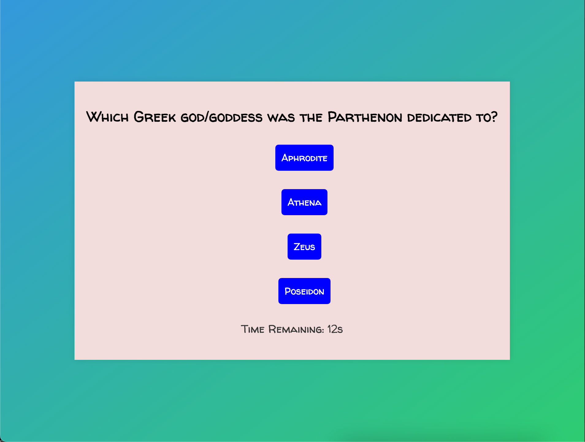
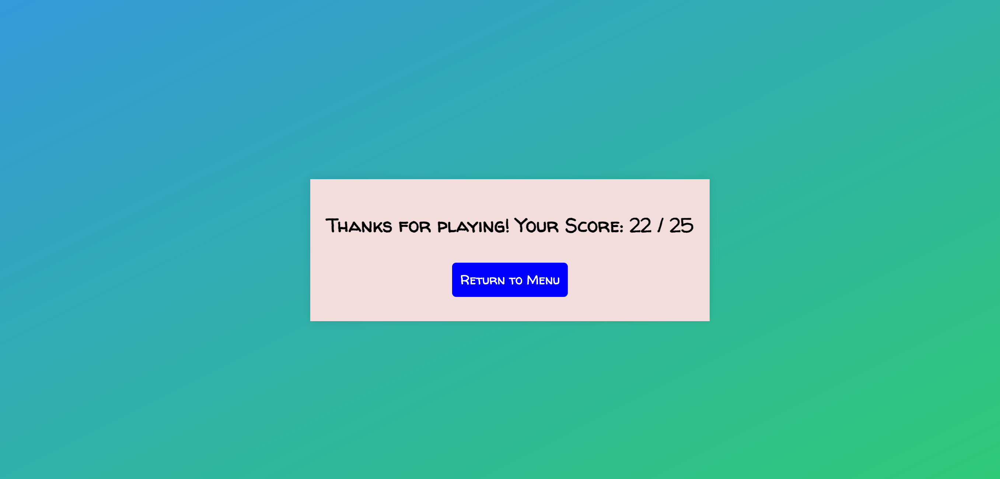

# TIME-TRAVEL-TRIVIA
•	Time Travel Trivia: 

Time Travel Trivia is a quiz game that challenges players' knowledge of history. The game includes one category: General History. This category contains 25 questions. Each question presents four potential answers, and players must choose the correct answer within a 15 second time limit. The interactive experience is enhanced through sounds and colors that indicate whether an answer is right or wrong. The game is structured into three main components: The main menu page, question/answer page, and results page. The menu page displays the title and a button players can click to begin the game. Upon completion, players are met by a results page which displays how many questions the player got right, along with a button players can click to return to the menu. 

Technologies Used: 

HTML, CSS, and JavaScript.

Getting Started: 

https://timetraveltrivia.netlify.app/

WireFrames/ Screenshots: 

Screenshots of Time Travel Trivia's menu, gameplay, and results pages. 

Timeline: Give us a table with all the project dates, MVP items meant for that day, whether you met your goal Y/N, and any notes about those items

| Day       | Task                                            | Complete |
|-----------|-------------------------------------------------|----------|
| Friday    | Create & Present proposal                       | Yes      |
| Saturday  | create html, css, JS; work on basic scaffolding | Yes      |
| Sunday    | add functionality                               | Yes      |
| Monday    | add styling                                     | Yes      |
| Tuesday   | finalize MVP                                    | Yes      |
| Wednesday | work on stretch goals                           | Yes      |
| Thursday  | work on icebox items                            | Yes      |
| Friday    | present                                         | Yes      |

Attributions: Include links to any external resources (such as libraries or assets) you used to develop your application.

https://uppbeat.io/browse/search?query=buzzer&type=sfx

https://uppbeat.io/sfx/tag/buzzer

https://chat.openai.com/

Next Steps: 

Planned future enhancements of this project include: 
    Broadened quiz variety.
    Wormhole animation between menu, game, and results page. 
    Click sounds.
    Music that plays on the menu and results pages. 
    Online features.
    Win/lose animations.
    Detailed educational insights following each question answered.
    Ability for players to see the correct answer if they chose the wrong answer.
